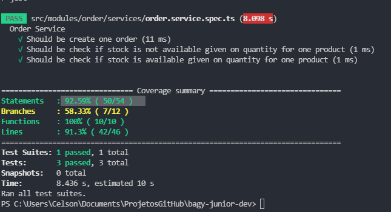
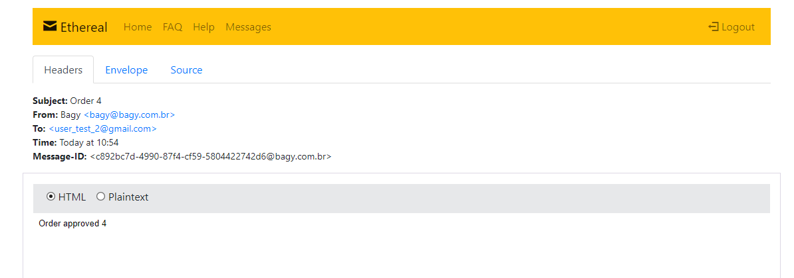

# Desafio Bagy para processo seletivo

Foi Realizado o Desafio da bagy com sucesso , passou nos testes.

## Executando o projeto

### Docker

`git clone https://github.com/lucascco/bagy-server.git`

`cd bagy-server`

- Este comando pode demorar um tempo
`docker build -t lucascco/bagy-server . `

`docker run -p 4000:8080 -d lucascco/bagy-server`

Agora é só acessar http://localhost:4000/graphql do seu navegador.

### Sem Docker

`git clone https://github.com/lucascco/bagy-server.git`

`cd bagy-server`

`yarn` or `npm install`

`yarn dev:server` or `npm run dev:server`

Agora é só acessar http://localhost:8080/graphql do seu navegador.

## Pass Test

## Print Header

## Print Envelope
